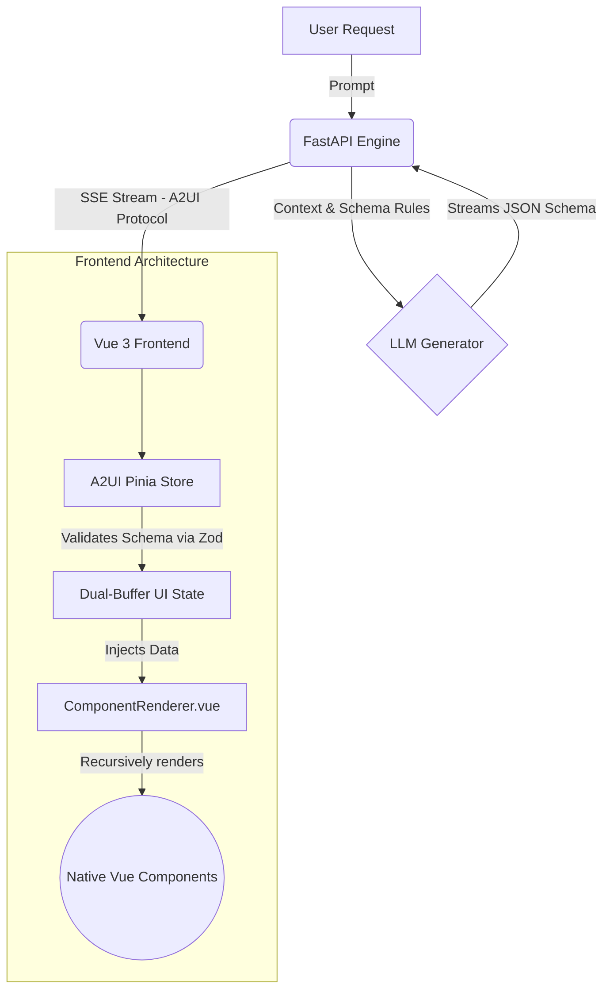
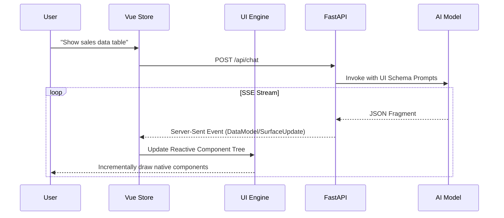

# 🌟 A2UI Studio: Generative UI Engine

[中文版本](readme-zh.md) | [A2UI Technical Report](A2UI_Technical_Report.md)

A2UI Studio is a next-generation **Generative UI (GenUI)** application built with Vue 3, Tailwind CSS, and FastAPI. It demonstrates the powerful concept of Server-Driven, Agent-to-User Interfaces (A2UI), where an artificial intelligence doesn't just return plain text or markdown, but instead **streams fully interactive, native UI components** directly into the chat interface.

## ✨ Core Features

- **🧠 True Generative UI**: Translates user intent into complex UI layouts (Dashboards, Tables, Charts, Product Cards) completely autonomously.
- **⚡ Streaming Component Rendering**: Utilizes Server-Sent Events (SSE) to incrementally stream UI components from the LLM, rendering them instantly without waiting for the full response.
- **🎨 Premium Design Aesthetics**: Built with customized Tailwind CSS featuring glassmorphism, soft drop shadows, rich typography, and micro-animations for a highly polished feel.
- **🧩 Recursive Layout Engine**: Supports nested responsive layouts generated on-the-fly, including `Grids`, `Columns`, and `Rows`.
- **🔄 Dual-Buffer State Sync**: Advanced Pinia integration that separates the pure component definitions from their reactive data models to prevent flickering during streaming.

## 🏗️ Functional Architecture

The system operates across three primary layers: the User Interface, the A2UI Engine, and the AI Backend.



### Dual-Mode Intent Routing (Text vs. Generative UI)

The system does not blindly force everything into UI components. A critical business logic layer, the `IntentRecognitionNode`, sits at the start of the pipeline.

- **The Routing Switch**: The node analyzes the prompt and mutates a shared state dictionary variable: `context['intent'] = 'chat'` (for text) or `context['intent'] = 'ui'` (for components).
- **Normal Chat Mode (`StandardChatNode`)**: If the context intent is `'chat'`, this node takes over, while UI nodes bypass execution via guard clauses (`if context.get('intent') != 'chat': return`). The LLM streams pure Markdown directly to the interface, handled gracefully by `A2Markdown.vue`.
- **Generative UI Mode (`ComplexUINode`)**: If the user asks for data visualization or dashboards ("Show my device metrics"), the intent is `'ui'`. The generative UI node takes over, invoking the strict `SYSTEM_PROMPT` schema enforcement to generate Native UI.

### The Component Data Contract (Prompt ↔ Zod ↔ Vue)

A critical challenge in Generative UI is ensuring the LLM outputs exactly the parameters the frontend components expect. A2UI solves this via a rigid, three-layer "Data Contract":

1. **The Backend Prompt Definition (`generator.py`)**: 
   The `SYSTEM_PROMPT` teaches the LLM the exact JSON shape required. For example, to render a Badge, it is prompted to output:
   `{"id":"bdg", "component": {"Badge": {"text": {"literalString": "New"}, "variant": "success"}}}`
   *Note*: Notice the strict `{"literalString": "..."}` wrapper. This is an A2UI protocol requirement to distinguish hardcoded strings from dynamic data bindings.

2. **The Zod Defense Wall (`a2uiSchema.ts`)**:
   Before Vue ever sees the data, the frontend parses the SSE stream through strict Zod schemas:
   ```typescript
   const BadgeComponent = z.object({
       Badge: z.object({
           text: z.object({ literalString: z.string() }).strict(),
           variant: z.enum(['success', 'warning', 'error', 'neutral']).optional()
       }).passthrough()
   })
   ```
   **Self-Healing (Anti-Hallucination):** Because LLMs make mistakes, `a2uiSchema.ts` contains a `fixComponentData()` interceptor. If the LLM generates `{"text": "New"}` (forgetting the wrapper) or hallucinates a tag like `<ProgressBar>` instead of `Progress`, the interceptor siliently mutates the JSON to the strict Zod format to prevent UI crashes.

3. **The Vue Component Props (`A2Badge.vue`)**:
   Finally, `ComponentRenderer.vue` passes the sanitized Zod output directly as Vue Props (`v-bind="component.Badge"`). `A2Badge.vue` simply declares `defineProps<{ text?: any, variant?: string }>()` and renders beautifully without needing to know it was generated by AI.

### Complete Business Flow & Technical Realization Path

The true magic of A2UI Studio lies in how it safely and quickly turns raw LLM stream tokens into beautiful native UI. Here is the exact technical path of a request:

1. **Intent Capture (`ChatInterface.vue`)**: The user prompts the system (e.g., "Build me an analytics dashboard"). The prompt is sent via a POST request to the backend.
2. **Constraint Injection (`generator.py`)**: The FastAPI server doesn't just forward the prompt. It wraps it in a massive `SYSTEM_PROMPT` that strictly defines the A2UI JSON Schema rules and available components, forcing the LLM to reply via structured layout trees (like `Grid`, `MetricCard`, `Progress` etc.) rather than markdown.
3. **SSE Streaming (`chat.py` & `Pinia Store`)**: As the LLM generates tokens, FastAPI parses them mid-flight. When an A2UI fragment like a `surfaceUpdate` (UI structure) or `dataModelUpdate` (Content) is completed, it fires a Server-Sent Event (SSE) to the frontend.
4. **Zod Defense Wall (`a2uiSchema.ts`)**: The frontend `a2ui.ts` pinia store intercepts the SSE chunk. Because LLMs hallucinate, the payload is immediately sanitized and passed through strict `Zod` validation architectures. If the LLM proposes an unsupported tag, it is caught and gracefully fallen back.
5. **Dual-Buffer Dom Injection**: To prevent UI flickering while the AI generates nested children, the store uses two buffers. It stages the generated component definitions (like `id: grid-1, type: Grid`) separately from the actual data payload. 
6. **Recursive Draw (`ComponentRenderer.vue`)**: Finally, the render engine spots a new `rootId` in the store. It iterates through the structure, dynamically mapping schema tags like `"MetricCard"` to the actual physical file `@/components/ui/A2MetricCard.vue`, drawing the native UI in real-time right before the user's eyes.



## 📂 Deep Dive: Project Structure & Technical Implementation

Understanding the A2UI codebase requires distinguishing the layout engine from the pure visual components.

```text
a2ui-lit-vue/
├── src/                          # The Vue 3 Frontend App
│   ├── components/               
│   │   ├── ui/                   # 🎨 Native Visual Components Library
│   │   │                         # Contains A2Button, A2MetricCard, A2Chart. 
│   │   │                         # These are standard Vue components styled with Tailwind,
│   │   │                         # entirely unaware they are being driven by AI.
│   │   │
│   │   ├── renderer/             # ⚙️ The Generative Engine Core
│   │   │   └── ComponentRenderer.vue # The recursive loop mapping AI Schema IDs to the /ui folder above.
│   │   │
│   │   └── ChatInterface.vue     # The main chat layout holding the message bubbles.
│   │
│   ├── composables/              
│   │   └── a2uiSchema.ts         # 🛡️ Zod Validation & Schema Fixes
│   │                             # The safety layer that normalizes LLM hallucinations 
│   │                             # (e.g. mapping "ProgressBar" back to "Progress" before rendering).
│   │
│   └── stores/
│       └── a2ui.ts               # 🧠 The SSE Network Layer & Dual-Buffer State Sync
│                                 # Listens to backend chunks and merges partial JSON into a reactive tree.
│
└── server/                       # The AI FastAPI Backend
    ├── app/
    │   ├── routes/
    │   │   └── chat.py           # Endpoint establishing HTTP Streaming response to frontend.
    │   │
    │   └── services/
    │       └── generator.py      # Prompt Engineering Masterclass
    │                             # Contains the rigorous SYSTEM_PROMPT forcing the LLM to output 
    │                             # grids and rows instead of single-column stacks.
```

## 🚀 Getting Started

### Prerequisites
- [Node.js](https://nodejs.org/) & [pnpm](https://pnpm.io/)
- Python 3.9+
- A valid LLM API Key (e.g., Gemini) for the backend.

### 1. Frontend Setup (Vue 3)

```bash
# Clone the repository
git clone <repository-url>
cd a2ui-lit-vue

# Install dependencies
pnpm install

# Start the Vite development server
pnpm dev
```
The frontend will be available at `http://localhost:5173`.

### 2. Backend Setup (FastAPI)

```bash
# Navigate to the server directory
cd server

# Create a virtual environment
python -m venv .venv
# Activate it (Windows)
.venv\Scripts\activate
# Activate it (Mac/Linux)
source .venv/bin/activate

# Install Python requirements
pip install -r requirements.txt

# Start the uvicorn server
uvicorn app.main:app --host 0.0.0.0 --port 8000 --reload
```

## 🛠️ Technology Choices & Pros/Cons Analysis

A2UI Studio implements a robust stack tailored specifically for AI-driven streaming:

- **Frontend**: Vue 3 + Pinia + Tailwind CSS
  - **Pros**: Highly reactive, simple virtual DOM updates, excellent ecosystem for standard dashboard widgets. Pinia excels at managing the dual-buffer architecture needed for streaming without blocking the main thread.
  - **Cons**: Recursively compiling entirely unknown structures dynamically at runtime can be expensive. Strictly dependent on predefined Tailwind classes; completely arbitrary CSS generated by the LLM is not supported for security/consistency.
- **Backend**: Python + FastAPI + AsyncOpenAI
  - **Pros**: FastAPI's native support for asynchronous Python generators maps perfectly 1:1 with LLM token streaming (SSE). Very fast, stateless execution.
  - **Cons**: Requires robust server-side parsing to safely map LLM strings to JSON stream chunks mid-flight.
- **Protocol**: Server-Sent Events (SSE) & Zod Validation
  - **Pros**: Unidirectional, low-latency streaming ideal for appending UI components. Zod provides an impenetrable defense against LLM output hallucinations.
  - **Cons**: Heavy maintenance overhead; any new native component added to the Vue frontend MUST be perfectly mirrored in the Zod schemas and Python prompt instructions.

## 🤝 Contributing

Contributions to A2UI Studio are highly encouraged! Whether it's adding a new native component for the LLM to use, refining prompting techniques, or optimizing the Zod parsing bridge, feel free to submit a pull request.

## 📄 License
This project is licensed under the MIT License.