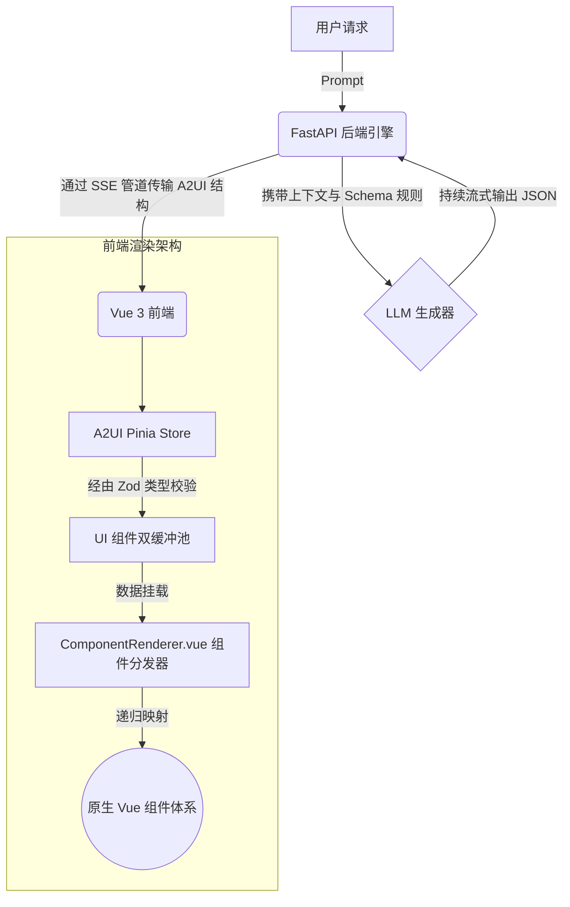
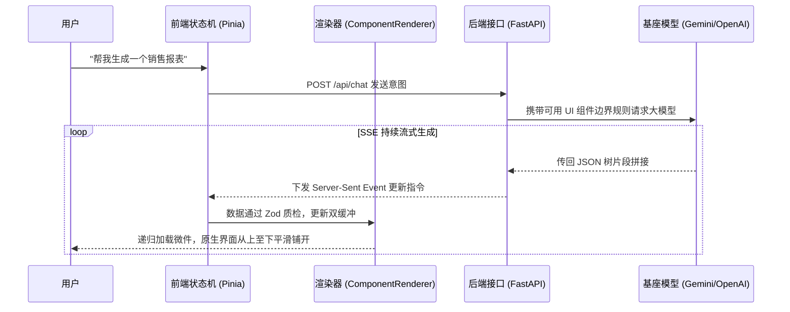

# 🌟 A2UI Studio: 生成式 UI 引擎

[English Version](README.md) | [A2UI 技术报告](A2UI_Technical_Report.md)

A2UI Studio 是一个由 Vue 3、Tailwind CSS 和 FastAPI 构建的下一代**生成式 UI (GenUI)** 应用程序。它展示了一种极具潜力的“代理驱动用户界面 (A2UI)”理念：人工智能不再仅仅返回纯文本或 Markdown 文本，而是**直接生成并流式传输完全可交互的、原生的前端 UI 组件**。

## ✨ 核心特性

- **🧠 真正的生成式 UI**：完全自主地将用户的意图转化为复杂的 UI 布局（如数据看板、表格、数据图表、商品卡片等）。
- **⚡ 流式组件渲染**：利用服务器发送事件 (SSE)，在 LLM 推理的过程中增量式加载并拼接 UI 组件，用户无需等待整个请求结束即可看到界面浮现。
- **🎨 极具质感的设计系统**：深度定制的 Tailwind CSS 体系，采用玻璃拟物化 (Glassmorphism)、柔和阴影、精致的排版和微交互动画，提供高级视觉体验。
- **🧩 递归网格布局引擎**：支持由 AI 动态规划的嵌套响应式布局，包括 `Grid` (网格)、`Column` (列堆叠) 和 `Row` (行分布)。
- **🔄 双缓冲状态同步机制**：通过高度优化的 Pinia 状态树，将 UI 组件的物理“结构描述”与其挂载的“数据模型”解耦并建立缓冲池，彻底消除流式渲染中的闪烁或乱序问题。

## 🏗️ 功能架构

整个系统的功能链条跨越三个核心层：UI 表现层、A2UI 数据协议层和 AI 后端生成层。



### 双模式意图动态路由 (文本对话 vs 生成式 UI)

系统在业务层面并非将所有请求盲目塞入 UI 组件引擎。流水线最初设有一个至关重要的拦截器：`IntentRecognitionNode` (意图识别节点)。

- **路由状态开关**：该节点首先分析提示词，并直接修改共享状态字典变量：判定为纯文本则赋值 `context['intent'] = 'chat'`，判定为组件则赋值 `context['intent'] = 'ui'`。
- **标准纯文本场景 (`StandardChatNode`)**：当下游节点读取到 intent 为 `'chat'` 时，文本节点接管流，而 UI 节点会通过前置守卫 (`if context.get('intent') != 'chat': return`) 直接跳过执行。此时后端向前端流式传输 Markdown 字符串，由 `A2Markdown.vue` 直接承载。
- **生成式组件场景 (`ComplexUINode`)**：当用户的表述涉及数据可视化、复杂排版（如“帮我画一个订单图”），intent 为 `'ui'`。UI 生成管线接管，唤起极为苛刻的 `SYSTEM_PROMPT` 锁，强制输出嵌套的 JSON Schema。

### UI 组件数据契约 (Prompt ↔ Zod ↔ Vue)

在生成式 UI 领域，最大的痛点就是“如何保证大模型精准输出前端组件所需要的参数结构”。A2UI 采取了极度严谨的三层“数据契约”模型来进行强制约束：

1. **后端提示词模板定调 (`generator.py`)**: 
   `SYSTEM_PROMPT` 会用 Few-Shot 的方式，穷举所有组件的 JSON 格式告诉大模型。例如，要想在屏幕画一个徽章，AI 必须严格输出：
   `{"id":"bdg", "component": {"Badge": {"text": {"literalString": "New"}, "variant": "success"}}}`
   *注*：这里采用 `{"literalString": "内容"}` 的嵌套包装，是 A2UI 的协议级规范，用于前端区分该字段是静态写死的字符串，还是动态绑定的变量引用。

2. **Zod 模式护城河验证 (`a2uiSchema.ts`)**:
   在 Vue 开始渲染之前，流式下发的碎片会被组装，并撞击在前端定义的严格 Zod Schema 墙上：
   ```typescript
   const BadgeComponent = z.object({
       Badge: z.object({
           text: z.object({ literalString: z.string() }).strict(),
           variant: z.enum(['success', 'warning', 'error', 'neutral']).optional()
       }).passthrough()
   })
   ```
   **大模型防幻觉自愈机制 (Self-Healing)：** 大语言模型具有不可控性（例如经常忘写 `literalString`，或者把进度条编造为 `<ProgressBar>` 而不是 `<Progress>`）。因此在送入 Zod 验证前，系统内建了 `fixComponentData()` 拦截器，利用脏检查将上述幻觉偷偷纠正为完全符合 Zod 标准的格式结构，保障应用不会因为 AI 犯蠢而突然白屏报错。

3. **Vue 原生接收层 (`A2Badge.vue`)**:
   当前两步校验通过后，`ComponentRenderer.vue` 会毫无保留地使用 `v-bind="component.Badge"` 语法，把净化的字典一把塞给原生的 Vue 组件。底层的 `A2Badge.vue` 只需要声明 `defineProps<{ text?: any, variant?: string }>()` 即可，它完全无需关心自己的数据是来自于后端手写 API，还是由 AI 每秒流式吐出来的。

### 应用完整业务流程与整体实现技术路径

A2UI 的技术精髓在于如何将原本不可控的大模型乱码词元 (Tokens) 安全、快速地转化为真实的客户端原生组件。这里是系统的一处完整请求链路的深入剖析：

1. **意图捕获层 (`ChatInterface.vue`)**：用户在前端提交需求（如：“帮我生成一个带业务指标和人员头像的看板”）。前端通过 POST 请求发送对话。
2. **规则注入引擎 (`generator.py`)**：后端的 FastAPI 收包后，并不直接转发给大模型。它会将用户需求拼接进入一个极其严厉的 `SYSTEM_PROMPT` 中。这个 Prompt 会强制大模型放弃生成 Markdown 文本，而是严格按照前端支持的组件映射表（例如 `Grid`、`MetricCard` 等），以嵌套 JSON Schema 的格式回复。
3. **基于 SSE 的流切片解析 (`chat.py` & `Pinia Store`)**：大模型开始吐出 Token，FastAPI 拦截并在内存中拼装完整的 JSON 节点。一旦识别出 UI 的框架层（`surfaceUpdate`）或是内容层（`dataModelUpdate`），服务器即刻利用 Server-Sent Events (SSE) 协议推向前端。
4. **Zod 模式护城河 (`a2uiSchema.ts`)**：前端 Pinia 库收到流碎片。由于大语言模型会产生幻觉 (Hallucination，如把 `Progress` 瞎编成 `ProgressBar`)，这些碎片会先被送入 Zod 规则网进行严格洗白、字段纠错、甚至进行黑名单过滤。
5. **双重缓冲池装载层**：若数据合规，Pinia 会通过双重缓冲池 (Dual Buffer) 锁住 UI 更新。由于 AI 生成是一个串行过程，为了防止子组件没生成完导致页面频闪，前端会分离“结构层池子”和“数值层池子”，待一整个子树准备妥当再推向响应式变量。
6. **递归按图索骥 (`ComponentRenderer.vue`)**：最终渲染引擎监听到新的根组件 `rootId` 落盘，引擎开始递归往下找子组件。它看到类型为 `"MetricCard"`，就如同拼图一般立刻去挂载物理文件 `@/components/ui/A2MetricCard.vue`，并将数据注入，从而在用户眼前呈现原生的业务卡片。



## 📂 工程目录浅析与技术切片

想要理解整个系统的运转机理，关键是要把“业务视觉排版”与“抽象的布局引擎”区分开来。这正是分层理念的体现：

```text
a2ui-lit-vue/
├── src/                          # Vue 3 核心前端端应用
│   ├── components/               
│   │   ├── ui/                   # 🎨 原生物理视觉组件库层
│   │   │                         # 大量极其细颗粒度的卡片如 A2Button, A2MetricCard, A2Chart。
│   │   │                         # 特点：这些组件内部全包含定制过的 Tailwind 样式（如阴影与环形边框），
│   │   │                         # 它们自己"完全不知道"自己在被 AI 控制。它们只是单纯响应 props 的展示组件。
│   │   │
│   │   ├── renderer/             # ⚙️ 生成式动态引擎核心
│   │   │   └── ComponentRenderer.vue # "大脑"分发器。这是全应用唯一使用了“递归”特性的组件，
│   │   │                             # 它负责接收 AI 生成的结构树字典，循环比对，并将数据无缝传递给上述的 /ui 组件。
│   │   │
│   │   └── ChatInterface.vue     # 主应用外壳壳体，支持防抖的输入框，聊天气泡外围的约束渲染容器等。
│   │
│   ├── composables/              
│   │   └── a2uiSchema.ts         # 🛡️ 大模型反幻觉免疫与 Zod 验证壁垒
│   │                             # 所有 AI 的流式数据在入库前必须经过此地。一旦 AI 发明了不存在的排版，
│   │                             # 这里会将其修正或转化为普通文字输出，防止前端框架爆红或无限循环导致白屏。
│   │
│   └── stores/
│       └── a2ui.ts               # 🧠 SSE 流网络管理与 Pinia 双缓冲池
│                                 # 具有极高技术含量的响应式对象管理方案（pendingComponents 与 components）。
│
└── server/                       # AI FastAPI 后端系统
    ├── app/
    │   ├── routes/
    │   │   └── chat.py           # Endpoint，负责维系高并发的 HTTP 长链接(SSE)通道。
    │   │
    │   └── services/
    │       └── generator.py      # Prompt 提示词工程管理与大模型基座集成点
    │                             # 最核心的提示词规范 (SYSTEM_PROMPT) 在此定义，严格指导了 AI 该用 Row 或 Grid 
    │                             # 实现栅格化仪表盘，而不是无脑输出冗长的单列 Column 组件。
```

## 🚀 快速启动

### 环境要求
- [Node.js](https://nodejs.org/) & [pnpm](https://pnpm.io/)
- Python 3.9+
- 有效的 LLM API Key（如 Gemini 等）。

### 1. 前端启动 (Vue 3)

```bash
# 克隆仓库
git clone <repository-url>
cd a2ui-lit-vue

# 安装依赖
pnpm install

# 启动 Vite 开发服务器
pnpm dev
```
前端界面将运行并监听在 `http://localhost:5173`。

### 2. 后端启动 (FastAPI)

```bash
# 进入服务端目录
cd server

# 创建并激活 Python 虚拟环境
python -m venv .venv

# Windows 激活方式:
.\.venv\Scripts\activate
# Mac/Linux 激活方式:
# source .venv/bin/activate

# 安装环境依赖包
pip install -r requirements.txt

# 启动 uvicorn 流式服务器
uvicorn app.main:app --host 0.0.0.0 --port 8000 --reload
```

## 🛠️ 技术选型与优缺点深度分析

A2UI Studio 的技术栈专门针对“AI 持久化流式渲染”场景进行了苛刻挑选：

- **前端侧**: Vue 3 + Pinia + Tailwind CSS
  - **优势 (Pros)**：双向绑定与现代化的响应式系统，非常适合应对这种细碎的频次更新。Pinia 充当“双缓冲池”的角色，在不阻塞主线程的前提下平滑过渡了 AI 流式输出时的残缺状态。
  - **劣势 (Cons)**：运行时利用 `ComponentRenderer.vue` 进行不确定的无限级递归渲染成本较高；受限于安全性，只能利用系统中已注册的原生物理组件与 Tailwind 样式池，模型无法“凭空捏造”一套全新的 CSS 动画。
- **后端侧**: Python + FastAPI + AsyncOpenAI
  - **优势 (Pros)**：FastAPI 原生对 Python 异步生成器 (AsyncGenerator) 的极佳支持，使得它处理大模型的流式出词、拼装打包 JSON 后转换成 SSE (Server-Sent Events) 推送，展现出了碾压级的低延迟效率。
  - **劣势 (Cons)**：由于中途需要拦截分段 JSON 并保证协议合法，后端的文本流解码与纠错逻辑比较繁重。
- **协议侧**: Server-Sent Events (SSE) 与 Zod 强校验
  - **优势 (Pros)**：SSE 是天然适合大模型单向输出、持续 Append 组件树的通信格式，比 WebSocket 更轻量；前端使用 Zod 作为绝对的“模式护城河”，杜绝了任何形式的大模型幻觉导致的前端崩溃。
  - **劣势 (Cons)**：可维护性挑战较大。一旦在前端 Vue 里新增了一种卡片组件，就必须同时在 Zod 的拦截器以及 Python 的 Prompt 系统提示词中同步更新文档规则，耦合度较高。

## 🤝 参与贡献

我们非常欢迎来自社区的贡献！无论是想要扩增更多的原生 UI 组件供大模型编排，还是想要改善后端的 prompt 指令提示效率，亦或是优化 Zod 校验网，您都可以直接提交 PR。

## 📄 开源协议
本项目采用 MIT License。